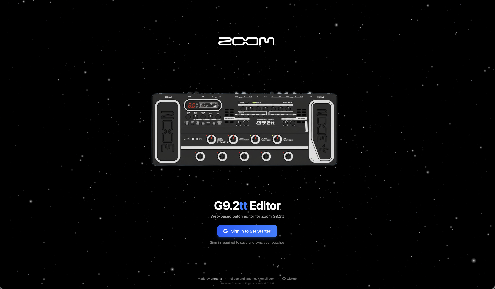
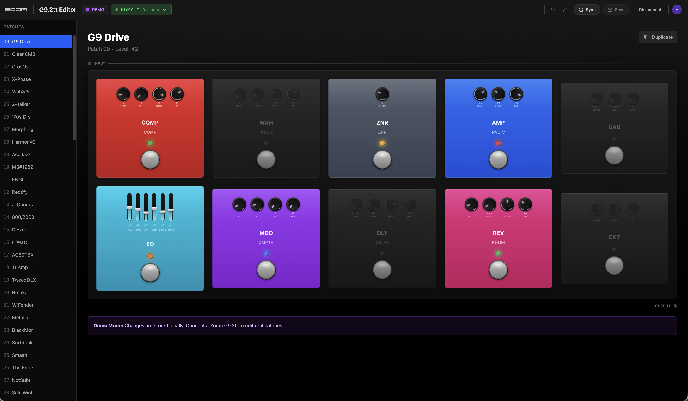
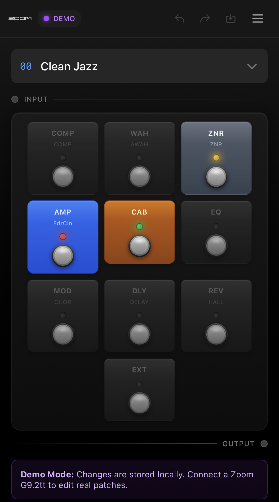
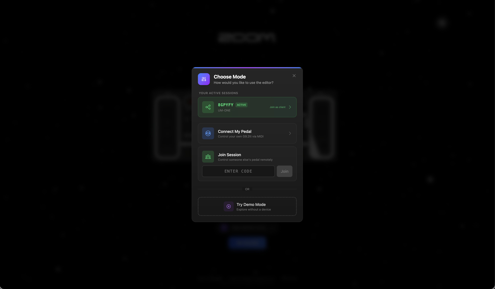

# Zoom G9.2tt Editor Web

Editor de patches moderno basado en navegador para el pedal multiefectos Zoom G9.2tt. Construido con React, TypeScript y Web MIDI API.

## Capturas de Pantalla

<p align="center">
  
  
  
</p>

<p align="center">
  <em>Izquierda: Pantalla de inicio con opciones de conexion | Centro: Editor en modo Demo | Derecha: Vista responsive movil</em>
</p>

<p align="center">
  
</p>

<p align="center">
  <em>Sesion colaborativa con modo Servidor/Cliente para control remoto</em>
</p>

---

## Funcionalidades

### Conexion de Dispositivo
- **Web MIDI API** - Conexion directa desde el navegador via interfaz MIDI USB
- **Auto-deteccion** - Identifica automaticamente dispositivos G9.2tt
- **Solucion de Problemas** - Diagnosticos integrados y funcionalidad de reintento
- **Modo Demo** - Explora la interfaz sin hardware

### Gestion de Patches
- **Leer/Escribir Patches** - Acceso completo a los 100 patches (U0-U99)
- **Edicion en Tiempo Real** - Los cambios se aplican instantaneamente al pedal
- **Duplicar Patches** - Copiar patches a nuevas ubicaciones
- **Renombrar Patches** - Editar nombres de patches (maximo 10 caracteres)
- **Operaciones en Lote** - Enviar todos los patches al dispositivo

### Modulos de Efectos
Edita los 10 modulos de efectos con control total de parametros:

| Modulo | Descripcion | Parametros |
|--------|-------------|------------|
| CMP | Compresor | Sense, Attack, Level |
| WAH | Wah/Filtro | Type, Position, Range |
| EXT | Loop Externo | Position, Level |
| ZNR | Reduccion de Ruido | Threshold, Decay |
| AMP | Simulador de Amplificador | 22 modelos, Gain, EQ, Level |
| EQ | EQ Parametrico | 6 bandas con frecuencia/ganancia |
| CAB | Simulador de Cabina | 16 tipos de cabina |
| MOD | Modulacion | Chorus, Flanger, Phaser, etc. |
| DLY | Delay | Time, Feedback, Mix |
| REV | Reverb | Type, Decay, Mix |

### Pedalera Virtual
- **Interfaz Visual** - Disposicion similar al pedal fisico
- **Click para Editar** - Selecciona cualquier modulo para editar
- **Activar/Desactivar** - Enciende o apaga modulos
- **Selector de Tipo** - Cambio rapido de tipo de efecto
- **Deslizadores de Parametros** - Ajuste intuitivo de valores
- **Botones de Precision** - Ajuste fino con +1/-1, +10/-10

### Sincronizacion en la Nube (Firebase)
- **Autenticacion con Google** - Inicia sesion con tu cuenta de Google
- **Respaldo de Patches** - Guarda automaticamente los patches en la nube
- **Sincronizacion Multi-dispositivo** - Accede a tus patches desde cualquier navegador
- **Soporte Sin Conexion** - Funciona sin internet, sincroniza cuando hay conexion

### Sesiones Colaborativas
Controla tu pedal remotamente desde otro dispositivo:

**Modo Servidor** (PC con MIDI):
- Crea una sesion y obtiene un codigo de 6 caracteres
- Comparte el codigo con otros
- Ve los clientes conectados
- Activa el Modo Live para enviar cambios al pedal

**Modo Cliente** (Telefono/Tablet):
- Une a una sesion con el codigo
- Control total de todos los parametros
- Ve actualizaciones de estado en tiempo real
- No necesita hardware MIDI

### Experiencia de Usuario
- **Responsive para Movil** - Funcionalidad completa en telefonos/tablets
- **Deshacer/Rehacer** - Historial de cambios de parametros
- **Pantalla de Inicio 3D** - Efectos de particulas animados
- **Tema Oscuro** - Facil para la vista

---

## Requisitos

### Navegador
- **Chrome 89+** (requerido para Web MIDI API)
- Otros navegadores basados en Chromium pueden funcionar (Edge, Opera)
- Firefox/Safari NO soportan Web MIDI

### Hardware
- Pedal Zoom G9.2tt
- Interfaz MIDI USB (Roland UM-ONE recomendada)
- Cables MIDI estandar de 5 pines

---

## Comenzar

### 1. Instalar Dependencias

```bash
npm install
```

### 2. Configurar Firebase (opcional)

Copia `.env.example` a `.env` y completa tu configuracion de Firebase:

```env
VITE_FIREBASE_API_KEY=tu-api-key
VITE_FIREBASE_AUTH_DOMAIN=tu-proyecto.firebaseapp.com
VITE_FIREBASE_PROJECT_ID=tu-proyecto-id
VITE_FIREBASE_STORAGE_BUCKET=tu-proyecto.appspot.com
VITE_FIREBASE_MESSAGING_SENDER_ID=123456789
VITE_FIREBASE_APP_ID=tu-app-id
VITE_FIREBASE_DATABASE_URL=https://tu-proyecto.firebaseio.com
```

### 3. Ejecutar Servidor de Desarrollo

```bash
npm run dev
```

Abre http://localhost:5173 en Chrome.

### 4. Conectar tu Pedal

1. Conecta la interfaz MIDI al PC via USB
2. Conecta MIDI OUT de la interfaz a MIDI IN del pedal
3. Conecta MIDI IN de la interfaz a MIDI OUT del pedal
4. Haz click en "Conectar Dispositivo" en la app
5. Selecciona tu interfaz MIDI cuando se te solicite

---

## Uso

### Modo Standalone (Por Defecto)

1. Conecta tu G9.2tt via MIDI
2. Haz click en "Conectar Dispositivo"
3. Selecciona patches de la lista
4. Haz click en los modulos de la pedalera para editar
5. Los cambios se envian al pedal en tiempo real cuando el Modo Live esta ACTIVADO

### Modo Demo

1. Haz click en "Modo Demo" en la pantalla de inicio
2. Explora la interfaz sin hardware
3. Todas las funciones operan excepto la comunicacion MIDI

### Sesion Colaborativa

**Como Servidor (con MIDI):**
1. Conecta tu pedal
2. Haz click en "Compartir Sesion" en el menu
3. Comparte el codigo de 6 caracteres
4. Activa el Modo Live para habilitar actualizaciones al pedal

**Como Cliente (remoto):**
1. Inicia sesion con Google
2. Ingresa el codigo de sesion
3. Controla parametros remotamente
4. Los cambios se sincronizan via Firebase al servidor

---

## Estructura del Proyecto

```
src/
├── pages/
│   ├── Editor.tsx          # Interfaz principal del editor
│   ├── Splash.tsx          # Pantalla de conexion/login
│   └── JoinSession.tsx     # Pagina para unirse a sesion
│
├── components/
│   ├── pedalboard/         # UI de pedalera virtual
│   │   ├── Pedalboard.tsx  # Layout principal
│   │   ├── ModulePanel.tsx # Edicion de modulos de efectos
│   │   └── MiniKnob.tsx    # Componente de perilla rotativa
│   │
│   ├── parameter/          # Controles de parametros
│   │   ├── Slider.tsx      # Deslizador de valores
│   │   └── TypeSelector.tsx # Selector de tipo de efecto
│   │
│   ├── dialogs/            # Dialogos modales
│   │   ├── BulkSendDialog.tsx
│   │   ├── DuplicatePatchDialog.tsx
│   │   └── RenamePatchDialog.tsx
│   │
│   ├── session/            # Componentes UI de sesion
│   └── common/             # Componentes compartidos
│
├── contexts/               # Gestion de estado con React Context
│   ├── AuthContext.tsx     # Autenticacion de usuario
│   ├── DeviceContext.tsx   # Estado del dispositivo MIDI
│   ├── PatchContext.tsx    # Estado de datos de patches
│   ├── SessionContext.tsx  # Sesion colaborativa
│   ├── SyncContext.tsx     # Sincronizacion con Firebase
│   └── HistoryContext.tsx  # Deshacer/rehacer
│
├── services/
│   ├── midi/
│   │   └── MidiService.ts  # Wrapper de Web MIDI API
│   ├── firebase/
│   │   ├── auth.ts         # Autenticacion
│   │   └── firestore.ts    # Operaciones de base de datos
│   └── session/
│       └── SessionService.ts # Gestion de sesiones
│
├── types/                  # Definiciones de TypeScript
│   ├── patch.ts            # Tipos de datos de patch
│   ├── midi.ts             # Tipos MIDI
│   └── session.ts          # Tipos de sesion
│
├── App.tsx                 # Componente raiz
└── main.tsx                # Punto de entrada
```

---

## Scripts

```bash
npm run dev       # Iniciar servidor de desarrollo
npm run build     # Compilar para produccion
npm run preview   # Vista previa de build de produccion
npm run lint      # Ejecutar ESLint
```

---

## Despliegue

### Firebase Hosting

```bash
npm run build
firebase deploy --only hosting
```

### Manual

Compila la carpeta `dist/` y sirvela con cualquier hosting estatico.

---

## Stack Tecnologico

| Tecnologia | Proposito |
|------------|-----------|
| React 19 | Framework de UI |
| TypeScript | Seguridad de tipos |
| Vite | Herramienta de build |
| Tailwind CSS 4 | Estilos |
| Three.js | Efectos 3D |
| Firebase | Auth, base de datos, hosting |
| Web MIDI API | Comunicacion con dispositivo |

---

## Solucion de Problemas

### "No se encontraron dispositivos MIDI"
- Asegurate de que la interfaz MIDI USB esta conectada
- Intenta desconectar y reconectar
- Verifica si otras apps estan usando el dispositivo MIDI
- Reinicia Chrome

### "El dispositivo no responde"
- Verifica las conexiones de cable MIDI (IN a OUT, OUT a IN)
- Apaga y enciende el pedal G9.2tt
- Prueba un puerto USB diferente

### "Navegador no soportado"
- Usa Chrome 89+ u otro navegador basado en Chromium
- Web MIDI no esta disponible en Firefox o Safari

### Los cambios no se aplican al pedal
- Asegurate de que el Modo Live esta ACTIVADO (indicador verde)
- Verifica las conexiones MIDI
- Confirma que el pedal esta en el modo correcto

---

## Licencia

MIT License
